
>>>>>  gd2md-html alert:  ERRORs: 0; WARNINGs: 0; ALERTS: 24.

<ul style="color: red; font-weight: bold"><li>See top comment block for details on ERRORs and WARNINGs. <li>In the converted Markdown or HTML, search for inline alerts that start with >>>>>  gd2md-html alert:  for specific instances that need correction.</ul>

Links to alert messages:
<a href="#gdcalert1">alert1</a>
<a href="#gdcalert2">alert2</a>
<a href="#gdcalert3">alert3</a>
<a href="#gdcalert4">alert4</a>
<a href="#gdcalert5">alert5</a>
<a href="#gdcalert6">alert6</a>
<a href="#gdcalert7">alert7</a>
<a href="#gdcalert8">alert8</a>
<a href="#gdcalert9">alert9</a>
<a href="#gdcalert10">alert10</a>
<a href="#gdcalert11">alert11</a>
<a href="#gdcalert12">alert12</a>
<a href="#gdcalert13">alert13</a>
<a href="#gdcalert14">alert14</a>
<a href="#gdcalert15">alert15</a>
<a href="#gdcalert16">alert16</a>
<a href="#gdcalert17">alert17</a>
<a href="#gdcalert18">alert18</a>
<a href="#gdcalert19">alert19</a>
<a href="#gdcalert20">alert20</a>
<a href="#gdcalert21">alert21</a>
<a href="#gdcalert22">alert22</a>
<a href="#gdcalert23">alert23</a>
<a href="#gdcalert24">alert24</a>

>>>>> PLEASE check and correct alert issues and delete this message and the inline alerts.

## Nodes

## 2D Noises

<table>
  <tr>
   <td>Fast Noise 2D
   </td>
   <td>

>>>>>  gd2md-html alert: inline image link here (to images/uTerrain-Node0.png). Store image on your image server and adjust path/filename if necessary.  (<a href="#">Back to top</a>)(<a href="#gdcalert2">Next alert</a>) >>>>> 

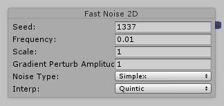

   </td>
   <td>Generates a value for every X/Z value based on the selected noise function.

Good for generating a heightfield.
<ul>

<li>Range of values: -1 to 1
</li>
</ul>
   </td>
  </tr>
  <tr>
   <td>Heightmap
   </td>
   <td>

>>>>>  gd2md-html alert: inline image link here (to images/uTerrain-Node1.png). Store image on your image server and adjust path/filename if necessary.  (<a href="#">Back to top</a>)(<a href="#gdcalert3">Next alert</a>) >>>>> 

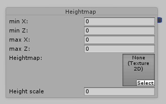

   </td>
   <td>Generates a scaled [0 to 1?] value for X/Z value based on a heightmap texture.

Good for generating a heightfield.
<ul>

<li>Range of values: either 0 to 1 or -1 to 1 (needs verification)
</li>
</ul>
   </td>
  </tr>
  <tr>
   <td>Other Noises 2D
   </td>
   <td>

>>>>>  gd2md-html alert: inline image link here (to images/uTerrain-Node2.png). Store image on your image server and adjust path/filename if necessary.  (<a href="#">Back to top</a>)(<a href="#gdcalert4">Next alert</a>) >>>>> 

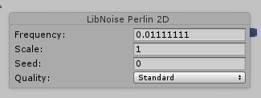

   </td>
   <td>Generates a value for every X/Z value based on the selected noise function.

Good for generating a heightfield.
<ul>

<li>Range of values: usually -1 to 1, sometimes -2 to 2
</li>
</ul>
   </td>
  </tr>
</table>

## 3D Noises

<table>
  <tr>
   <td>Fast Noise 3D
   </td>
   <td>

>>>>>  gd2md-html alert: inline image link here (to images/uTerrain-Node3.png). Store image on your image server and adjust path/filename if necessary.  (<a href="#">Back to top</a>)(<a href="#gdcalert5">Next alert</a>) >>>>> 

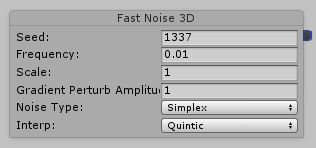

   </td>
   <td>Generates a volume of values based on the selected noise function.

Can be used to generates "blobs in space," "floating islands," disassociated pockets of void.
<ul>

<li>Range of values: -1 to 1?
</li>
</ul>
   </td>
  </tr>
  <tr>
   <td>Other Noises 3D
   </td>
   <td>

>>>>>  gd2md-html alert: inline image link here (to images/uTerrain-Node4.png). Store image on your image server and adjust path/filename if necessary.  (<a href="#">Back to top</a>)(<a href="#gdcalert6">Next alert</a>) >>>>> 

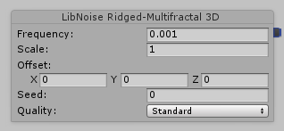

   </td>
   <td>Generates a volume of values based on the selected noise function.

Can be used to generates "blobs in space," "floating islands," disassociated pockets of void.
<ul>

<li>Range of values: usually -1 to 1, sometimes -2 to 2
</li>
</ul>
   </td>
  </tr>
</table>

## Combiners

<table>
  <tr>
   <td>Blend: Add
   </td>
   <td>

>>>>>  gd2md-html alert: inline image link here (to images/uTerrain-Node5.png). Store image on your image server and adjust path/filename if necessary.  (<a href="#">Back to top</a>)(<a href="#gdcalert7">Next alert</a>) >>>>> 

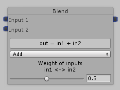

   </td>
   <td>Adds two values. \
 \
Weight is multiplied to in and out, so addition is more like a weighted average.

Example: if weight = 0.25, input1 = 2, input2 = 1: \
= (2 * 0.25) + (1 + 0.75) \
= .5 + .75 \
= 1.25
   </td>
  </tr>
  <tr>
   <td>Blend: Subtract
   </td>
   <td>

>>>>>  gd2md-html alert: inline image link here (to images/uTerrain-Node6.png). Store image on your image server and adjust path/filename if necessary.  (<a href="#">Back to top</a>)(<a href="#gdcalert8">Next alert</a>) >>>>> 

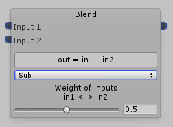

   </td>
   <td>Subtracts two values, using weighting as in Add mode (see above).
   </td>
  </tr>
  <tr>
   <td>Blend: Multiply
   </td>
   <td>

>>>>>  gd2md-html alert: inline image link here (to images/uTerrain-Node7.png). Store image on your image server and adjust path/filename if necessary.  (<a href="#">Back to top</a>)(<a href="#gdcalert9">Next alert</a>) >>>>> 

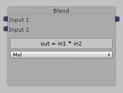

   </td>
   <td>Multiplies two values.
   </td>
  </tr>
  <tr>
   <td>Blend: Min
   </td>
   <td>

>>>>>  gd2md-html alert: inline image link here (to images/uTerrain-Node8.png). Store image on your image server and adjust path/filename if necessary.  (<a href="#">Back to top</a>)(<a href="#gdcalert10">Next alert</a>) >>>>> 

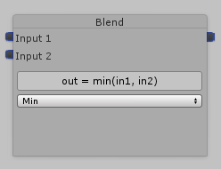

   </td>
   <td>Outputs the minimum of two values.
   </td>
  </tr>
  <tr>
   <td>Blend: Max
   </td>
   <td>

>>>>>  gd2md-html alert: inline image link here (to images/uTerrain-Node9.png). Store image on your image server and adjust path/filename if necessary.  (<a href="#">Back to top</a>)(<a href="#gdcalert11">Next alert</a>) >>>>> 

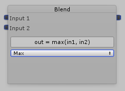

   </td>
   <td>Outputs the maximum of two values.
   </td>
  </tr>
</table>

## Filters

<table>
  <tr>
   <td>Abs
   </td>
   <td>

>>>>>  gd2md-html alert: inline image link here (to images/uTerrain-Node10.png). Store image on your image server and adjust path/filename if necessary.  (<a href="#">Back to top</a>)(<a href="#gdcalert12">Next alert</a>) >>>>> 

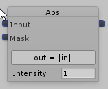

   </td>
   <td>Return absolute value of input.
   </td>
  </tr>
  <tr>
   <td>Clamp
   </td>
   <td>

>>>>>  gd2md-html alert: inline image link here (to images/uTerrain-Node11.png). Store image on your image server and adjust path/filename if necessary.  (<a href="#">Back to top</a>)(<a href="#gdcalert13">Next alert</a>) >>>>> 

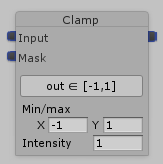

   </td>
   <td>Return input clamped to min/max range.
   </td>
  </tr>
  <tr>
   <td>Curve
   </td>
   <td>

>>>>>  gd2md-html alert: inline image link here (to images/uTerrain-Node12.png). Store image on your image server and adjust path/filename if necessary.  (<a href="#">Back to top</a>)(<a href="#gdcalert14">Next alert</a>) >>>>> 

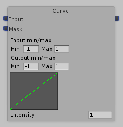

   </td>
   <td>Apply in-range to out-range, using curve, clamped within out-range)
   </td>
  </tr>
  <tr>
   <td>Invert
   </td>
   <td>

>>>>>  gd2md-html alert: inline image link here (to images/uTerrain-Node13.png). Store image on your image server and adjust path/filename if necessary.  (<a href="#">Back to top</a>)(<a href="#gdcalert15">Next alert</a>) >>>>> 

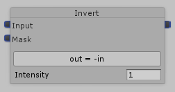

   </td>
   <td>Invert value
   </td>
  </tr>
  <tr>
   <td>Lerp
   </td>
   <td>

>>>>>  gd2md-html alert: inline image link here (to images/uTerrain-Node14.png). Store image on your image server and adjust path/filename if necessary.  (<a href="#">Back to top</a>)(<a href="#gdcalert16">Next alert</a>) >>>>> 

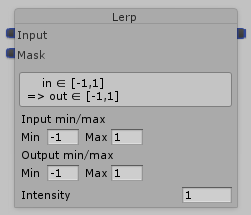

   </td>
   <td>Linearly interpolate in-range to out-range, clamped within out-range)
   </td>
  </tr>
  <tr>
   <td>Scale bias
   </td>
   <td>

>>>>>  gd2md-html alert: inline image link here (to images/uTerrain-Node15.png). Store image on your image server and adjust path/filename if necessary.  (<a href="#">Back to top</a>)(<a href="#gdcalert17">Next alert</a>) >>>>> 

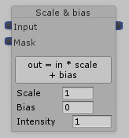

   </td>
   <td>Multiply input by scale, add bias
   </td>
  </tr>
  <tr>
   <td>Terrace
   </td>
   <td>

>>>>>  gd2md-html alert: inline image link here (to images/uTerrain-Node16.png). Store image on your image server and adjust path/filename if necessary.  (<a href="#">Back to top</a>)(<a href="#gdcalert18">Next alert</a>) >>>>> 

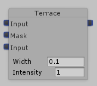

   </td>
   <td>Reduce values to a set of terrace values, of a defined width.

Width is dynamic: width (constant width) * input_width
   </td>
  </tr>
</table>

## Transformers

<table>
  <tr>
   <td>To Height
   </td>
   <td>

>>>>>  gd2md-html alert: inline image link here (to images/uTerrain-Node17.png). Store image on your image server and adjust path/filename if necessary.  (<a href="#">Back to top</a>)(<a href="#gdcalert19">Next alert</a>) >>>>> 

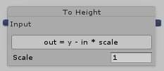

   </td>
   <td>Sets voxel values for current X/Z column that are positive above input * scale, negative below it.
   </td>
  </tr>
  <tr>
   <td>To Slope
   </td>
   <td>

>>>>>  gd2md-html alert: inline image link here (to images/uTerrain-Node18.png). Store image on your image server and adjust path/filename if necessary.  (<a href="#">Back to top</a>)(<a href="#gdcalert20">Next alert</a>) >>>>> 

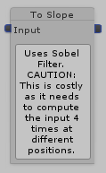

   </td>
   <td>Returns steepness at location. \
0 = level ground, higher numbers = steeper
   </td>
  </tr>
</table>

## Final

<table>
  <tr>
   <td>Biome Selection
   </td>
   <td>

>>>>>  gd2md-html alert: inline image link here (to images/uTerrain-Node19.png). Store image on your image server and adjust path/filename if necessary.  (<a href="#">Back to top</a>)(<a href="#gdcalert21">Next alert</a>) >>>>> 

   </td>
   <td>Can have multiple of these nodes. The one with the highest weight will define the biome at any X/Y/Z position.
   </td>
  </tr>
  <tr>
   <td>Voxel Type
   </td>
   <td>

>>>>>  gd2md-html alert: inline image link here (to images/uTerrain-Node20.png). Store image on your image server and adjust path/filename if necessary.  (<a href="#">Back to top</a>)(<a href="#gdcalert22">Next alert</a>) >>>>> 

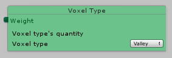

   </td>
   <td>Can have multiple of these nodes. The one with the highest weight will define the voxel at any X/Y/Z position.
   </td>
  </tr>
  <tr>
   <td>Final
   </td>
   <td>

>>>>>  gd2md-html alert: inline image link here (to images/uTerrain-Node21.png). Store image on your image server and adjust path/filename if necessary.  (<a href="#">Back to top</a>)(<a href="#gdcalert23">Next alert</a>) >>>>> 

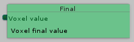

   </td>
   <td>Receives voxel value (distance from surface, negative is underground)
   </td>
  </tr>
</table>

## Position

<table>
  <tr>
   <td>X | Y | Z
   </td>
   <td>

>>>>>  gd2md-html alert: inline image link here (to images/uTerrain-Node22.png). Store image on your image server and adjust path/filename if necessary.  (<a href="#">Back to top</a>)(<a href="#gdcalert24">Next alert</a>) >>>>> 

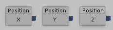

   </td>
   <td>Feeds a single dimension of the current location into other nodes.
   </td>
  </tr>
</table>

## Constant

<table>
  <tr>
   <td>Constant
   </td>
   <td>

>>>>>  gd2md-html alert: inline image link here (to images/uTerrain-Node23.png). Store image on your image server and adjust path/filename if necessary.  (<a href="#">Back to top</a>)(<a href="#gdcalert25">Next alert</a>) >>>>> 

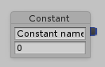

   </td>
   <td>Feeds a constant into other nodes.
   </td>
  </tr>
</table>
