# Setting Up Your First Terrain
## Introduction
This Tutorial is designed to take you through the basics of setting up a complete terrain from scratch. If you haven't looked over the [Installation Guide](installation.md), please take a look at that before getting started.

While Ultimate Terrains has been designed so that you can get up and running with your first terrain in just a few minutes, you will need to spend some time learning about its many parameters and options in order to create the exact terrain you need for your situation.

## Initial Scene Setup
Let's start with a clean, blank scene: *File > New scene* or create a scene in your Project view and double-click to open it.

Next, let's add a player to the scene.

There is a simple Player prefab included with Ultimate Terrains for you to use here:
* In your Project view, navigate to `Assets/uTerrains/Scenes/Misc`.
* Drag & drop the *FreeFlyPlayer* prefab into your scene's hierarchy view.

You can also just use the Main Camera as a player object or use your own Player object.

## Creating an Ultimate Terrain

All right, let's begin! First we'll add a new ultimate terrain to your scene:

* In Unity's top menu, select *Tools > uTerrains > New terrain...*.
* This will open a window where you can initialize a couple of basic settings for your the new uTerrain. Don't worry, you will be able to change any of these settings later in the Ultimate Terrain inspector.

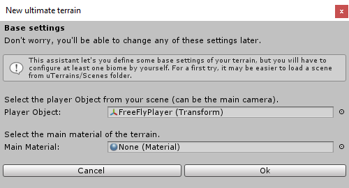

* Drag & drop your Player object into the *Player Object* field.
* Drag & drop a base material in the *Main Material* field. To start with, you can use the included materials under `Assets/uTerrains/Materials/Terrain`. We'll be changing this shortly.
* Click OK.

You should now see a new object with the default name 'uTerrain' in your scene. Select it to display the uTerrain inspector.

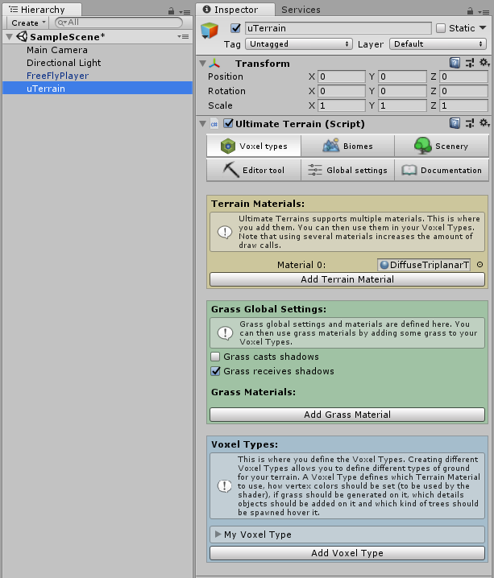

## uTerrain Setup
With our new uTerrain selected in the Hierarchy view, you can see that the uTerrain inspector has 6 main tabs:

* Voxel Types
* Biomes
* Scenery
* Editor Tool
* Global Settings
* Documentation

Before moving on to generate our terrain we'll need to do a tiny bit of basic setup.

### Global Settings

First let's go to the 'Global Settings' tab. There are a lot of settings here, but for now all we're going to do for now is define layers for chunks and grass.
* Define two new Layers, one for uTerrains Chunks and one for uTerrains Grass. It's not strictly necessary to define the layer for grass right now, but while we're here we might as well do it.

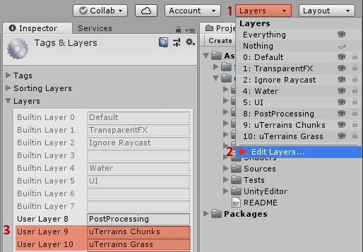

* Expand the **General Settings** rollout (if it isn't already open) and find the section at the bottom that says 'Choose the layer of terrain's chunks'.

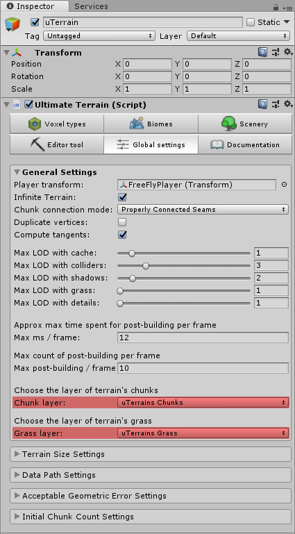

### Voxel Types

Now let's go back to the Voxel Types tab.

As you can probably guess from looking at this tab, the Voxel Types section manages our terrain's
* Materials
* Global Grass Settings and
* Voxel Types

Let's brifely talk about what each of these does.

#### Terrain Materials
In this section, you can manage the materials available for use by our terrain. You should already see the material you've selected a few minutes ago in the *New Terrain* window. Let's add a couple of new materials now.
* In your Project view, under Assets, create a new folder called "Materials".
* Right click on your new Materials directory and select *Create > Material*. Let's rename this material to "Grass".
* Let's just use the Unity Standard Shader for now. We'll set the Albedo to a nice grass green color (say, rgb values 145, 185, 16) and then set both the Metallic and Smoothness values to 0.
* Duplicate the Grass material twice by selecting it in the project view and hitting Ctrl+D (Command+D on Mac).
  * Rename one of the duplicate materials "Rock" set its Albedo color to a nice medium gray (say, rgb 130, 124, 137)
  * Rename the other duplicate material "Snow" and set its Albedo color to white (rgb 255, 255, 255).
* Now let's replace the default Material 0 with our Rock material.
* Click the *Add Terrain Material* button and then assign our Grass material to the new slot, and do the same again for our snow slot.

Now we should have 3 Materials to work with in out Terrain Materials section: Rock, Grass, and Snow.

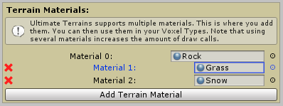

#### Grass Global Settings
In this section we can configure the global parameters of our terrain's grass and add materials for grass. We'll leave this section empty for now and circle back around to it later.

#### Voxel Types
Finally, and most importantly, this section is where we define the different types of Voxels for our terrain. By default, a new uTerrain comes with one default Voxel Type. Let's take a closer look at it:
* Expand the rollout for the default Voxel Type *My Voxel Type*.

As you can see, uTerrain's Voxel Types are defined by a fairly simple set of parameters. We'll only touch a few of these for now, but if you would like more info about each parameter, check out the documentation for [Voxel Types](voxel-types.md)

Let's set up a few Voxel Types to work with in our terrain:
* Add two more Voxel Types by clicking the *Add Voxel Type* button.
* Rename the one called "My Voxel Type" to "Rock" and the other two to "Grass" and "Snow".
* Now for each we'll set them up as follows:
  * **Rock**
    *Name:* Rock
	*Material Index:* 0 (make sure this matches your Rock material index in the *Terrain Materials* section above)
	*Priority:* 1
	*Blockiness:* 0.25
	Leave the rest of the settings as-is
  * **Grass**
    *Name:* Grass
	*Material Index:* 1 (make sure this matches your Grass material index in the *Terrain Materials* section above)
	*Priority:* 2
	*Blockiness:* 0
	Leave the rest of the settings as-is
  * **Grass**
    *Name:* Snow
	*Material Index:* 2 (make sure this matches your Grass material index in the *Terrain Materials* section above)
	*Priority:* 3
	*Blockiness:* 0
	Leave the rest of the settings as-is

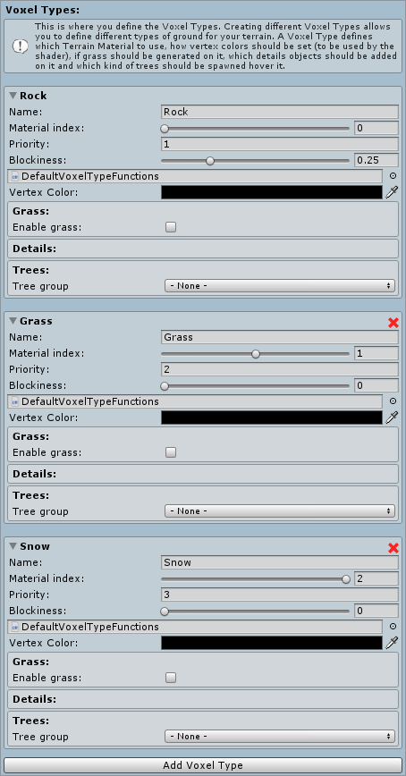

That should do it for Voxel Types. You can come back and add more Voxel Types or modify the existing ones whenever necessary.

## Generating our Terrain

Now that we have our basic setup complete we can get to the meat of uTerrains. This is where we get to define how our terrain looks and how our Voxels are generated.

### The Biomes Tab

In the uTerrains Inspector, select the Biomes tab.

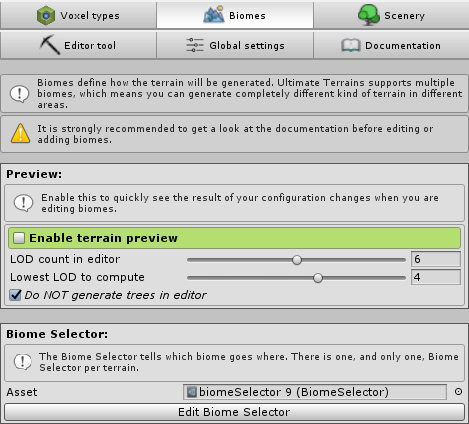

#### Preview

At the top of the Biomes tab you'll see the Preview section. This contains a couple of settings for previewing your terrain in the Unity Editor without having to enter Play Mode.

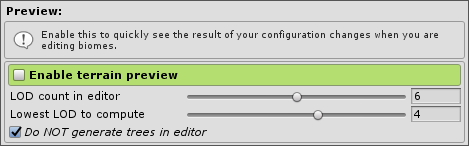

In order to keep terrain previews quick when iterating on your terrain uTerrains allows us to adjust two settings: **LOD count in editor** and **Lowest LOD to compute**. These will dictate the highest and lowest LODs that uTerrains will generate for in-editor previews.

Since we haven't created any Biomes yet, checking the box next to *Enable terrain preview* will just give us a pop-up telling us that we don't have a valid configuration and generate an error, so we can leave it alone for now.

#### Biome Selector

Before we can really talk about the *Biome selector*, we need to have an understanding of what a *Biome* is. In the most basic sense, a Biome in Ultimate Terrains is a ScriptableObject that defines a set of rules for:
* generating Voxel values to generate a terrain mesh
* prioritizing Voxel Types for any given Voxel within the terrain

Our uTerrain can have lots of *Biomes* but only one *Biome Selector*, so the *Biome Selector* is responsible for choosing which *Biome* to use at a given point in the entire terrain volume when we need one of the above values.

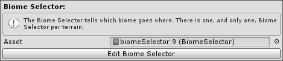

Since we don't really have any biomes set up yet, it's a bit early to try to decide which one to use at a given point in our terrain, so let's create some Biomes and then come back to this.

#### Creating a Biome

Alright, let's create our first biome! Take a look at the next section of the Biomes tab, simply called 'Biomes'.

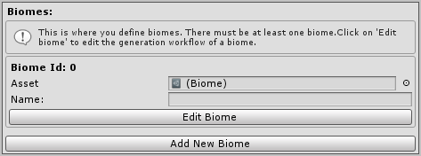

You'll see that one Biome has already been added by default, but let's create our own to use:
* In the Project view, navigate to `Assets/uTerrains/Biomes/`
* Select the ScriptableObject called `flat-biome` and hit Ctrl+D (Command+D on Mac) to duplicate it, then rename it to "Grassy Hills".
* Select the uTerrains object in the scene view to bring up the uTerrains inspector again.
* Drag and drop our new Grassy Hills Biome object from the Project view back over to the *Asset* field in the Biomes section.
* We'll also need to fill in the *Name* field just below this with "Grassy Hills".

While we're here, it would be convenient to create our second Biome:
* Duplicate our Grassy Hills Biome in the Project view and rename it "Rocky Mountains"
* Navigate back to the uTerrains inspector and click Add New Biome.
* Drag the new Rocky Mountains Biome object into the new slot and set its *Name* field to "Rocky Mountains" to match.

Exciting! We have some biomes! Let's go back to the Preview section of the Biomes tab and check the *Enable terrain preview* box and see what it looks like so far.

A little underwhelming... But it's a start! Let's get some hills in there:
* Leaving Terrain preview enabled, find your Grassy Hills Biome (**Biome ID: 0**) and click Edit Biome.

#### The Biome Editor

A new Editor window called "Generation Flow" will appear with a simple node graph. Let's start by un-docking the window and making it bigger so we can see what's going on.

This graph represents the general flow of Voxel generation and Voxel Type selection. 

#### The Node Canvas

If you're already familiar with the concept of a node-based editor this will probably look familiar to you. If not, check out the documentation on the [Node-Based Editor](node-based-editor.md) which has a high-level overview of node-based editors in general and a section on the controls specifc to uTerrain's own node editor.

### Generating Hills

Without worrying too much about what each of these nodes is doing behind the scenes, you can probably tell that our terrain is using a *Constant* node wired up to a *To Height* node to create a flat terrain surface at y=0.5. The *To Height* node is then wired up to the *Final* node, which is the endpoint of our Voxel value processing.

You probably noticed that we have a *Constant* wired up to a *Voxel Type* endpoint as well... Biome graphs also handle Voxel Type selection. For now, let's focus on shaping our terrain.

Let's make some hills with some simple 2D noise:
* Right-click on an empty area of the graph and select *2D Noises > Fast Noise 2D*.
* Delete the Constant node named "Altitude".
* Wire up our new Fast Noise 2D node in its place.

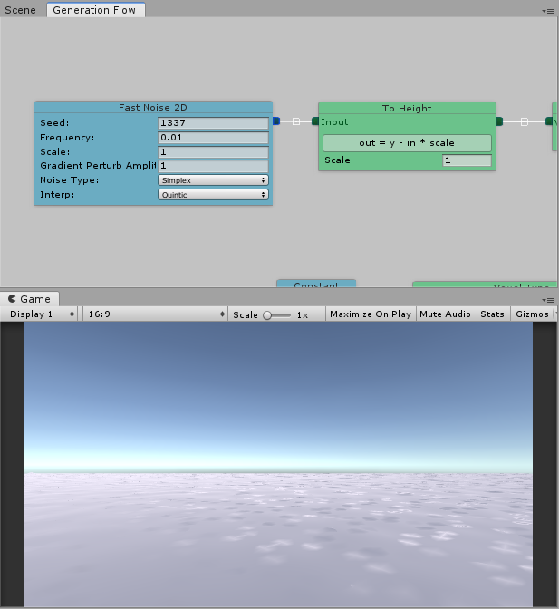

We're getting something, but it's hard to tell what it is.
* Change the Scale value in the To Height node to 15.
* You may need to toggle the *Enable terrain preview* checkbox on and off to see the terrain update properly

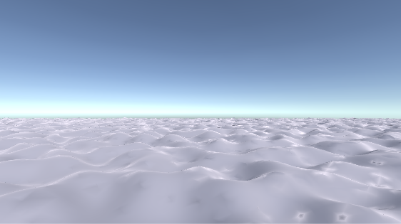

That's looking more like hills, but we can do better. Let's modify the output of our noise:
* Delete the connection between the output of our *Fast Noise 2D* node and the input of our *To Height Node* by clicking on the white box in the middle of the connection.
* Right click on an empty part of the canvas and select *Filters > Abs* to add an *Absolute Value* node.
* Wire up the output of our *Fast Noise 2D* node to the "Input" handle of our *Abs* node.
* Wire up the output of our *Abs* node to the input of our *To Height* node.

Let's also add a capsule to our scene so that we can get a sense of scale for these hills:
* In your scene view, right click and select *3D Object > Capsule*
* Adjust the position of the FreeFlyPlayer and the Capsule object so that the capsule rests on the ground and you can see it in the game view.

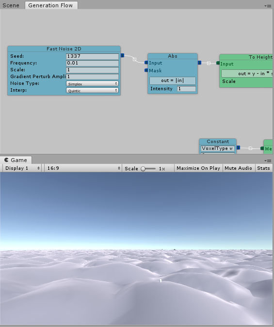

That's looking more like hills, but it's a bit chunky. Fortunately, that's just because we're displaying a low-LOD version of the terrain in the editor. Click Play in the Editor to see the high-resolution version.

_**Note:** if you are using the FreeFlyPlayer prefab included with uTerrains you may get an error in the console. It's fine to ignore this for now._

When you exit Play Mode you may need to toggle the terrain preview off and on again to see your terrain re-appear.

### Layering Hills

So we've got an endless terrain of hills that are all the same height. It's something, but it's a bit uniform and boring. There are lots of ways to do this, but in order to demonstrate combining nodes, we'll combine two *Fast Noise 2D* nodes using a *Blend* node:
* Create another *Fast Noise 2D* node
* Create a Blend node by selecting *Combiners > Blend* from the Create Node menu.
* Wire up the two *Fast Noise 2D* nodes to the inputs of the *Blend* node.
* Wire up the output of the *Blend* node to the input of the *Abs* node.

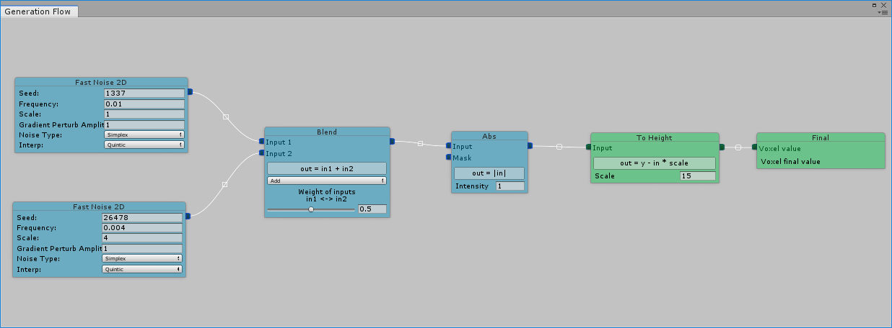

You probably won't notice much change yet. We'll need to make a couple of changes to the settings on one of our noise nodes.

On one of the *Fast Noise 2D* nodes (it doesn't matter which one) change the following fields:
* **Seed:** any random number, say 26478
* **Frequency:** 0.004
* **Scale:** 4

When the preview reloads or when you enter Play Mode, you should see a little more variety in your hills.

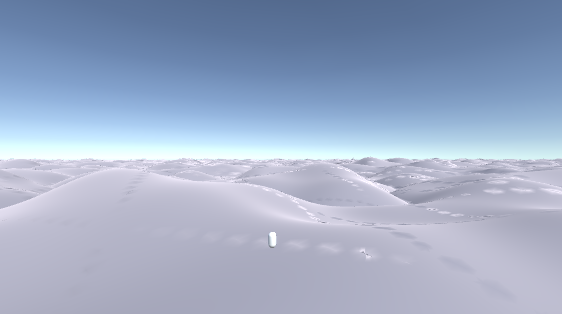

So let's talk about what's going on between our nodes here...

**Noise nodes:**
* At any given x,z position in the terrain the *Fast Noise 2D* nodes are using a noise algorithm (in this case we've selected Simplex Noise) to generate a values between between -1 and 1.
* The **frequency** value of the noise nodes controls the size of the noise pattern * The scale value multiplies the output of the noise algorithm so that one node is outputting values between -1 and 1 and the other is outputting values between -4 and 4.
* The *seed* number we provide is used to randomize the noise algorithm's pattern in a reproducible way.

**Blend Node:**
Next, in the *Blend* node we add the output of the two noise nodes together so that at a given x,z position the output value is given by Noise Node 1 + Noise Node 2. That means that in theory we could get values as low as -5 and as high as 5. Realistically values come out to less than that in virtually all cases due to positive and negative values adding together.

**Abs Node**
Once the noise values are added together we do an absolute value operation on the value at each x,z coordinate, which makes all the negative values positive. Now our theoretical output range will be between 0 and 5.

**To Height**
It's important to remember that when we get to the end of our graph we're not working in 2D height maps, but rather 3D voxel maps. *Final* node is expecting to receive Voxel values, which come in a range of -1 to 1, where positive values represent voxels above or "outside" the terrain surface and negative values represent voxels below or "inside" the terrain surface.

Because of that, we need a special node to convert 2D height map values (which we use because they're intuitive and much less computationally intensive to create) into 3D voxel map values. That's exactly what the *To Height* node does:
* First, the input values are multiplied by the scale value, so our theoretical height range will now be 0 to 5 * 15. (Again, realistically it's much lower... more like 0 to 35.)
* Finally at a given x,z position any voxel below y=input will be positive and any voxel above y=input will be negative.

That got pretty technical, but it will really help to have this fundamental understanding as we move into using 3D nodes to generate more complex terrains. Speaking of which, these seem like reasonable hills for now, let's move on...

Lastly, let's just change our voxel type to Grass:
* Under the *Voxel Type* node, select Grass from the dropdown. (We'll cover multiple Voxel Types later on.)

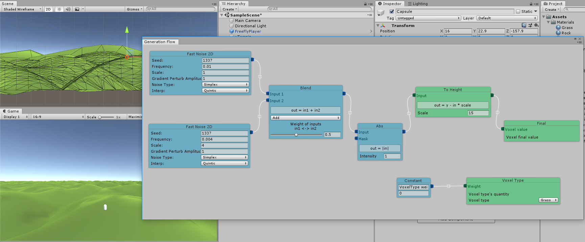

Don't forget to save your scene!

### I want to see mountains again, Gandalf, mountains!

Navigate back to the uTerrains Inspector's Biomes tab. While we could start editing our Rocky Mountains Biome right away, it would be helpful if we were able to see it.

Instead, let's click *Edit Biome Selector* in the section above.

#### Back to the Biome Selector

As should be fairly apparent, the *Biome Selector Editor* uses the same node editor that the *Biome Editor* does, however it works a little differently. Instead of voxel values, at any given x,y,z point in the terrain the biome selector will select the Biome receiving the highest output to generate a voxel value.

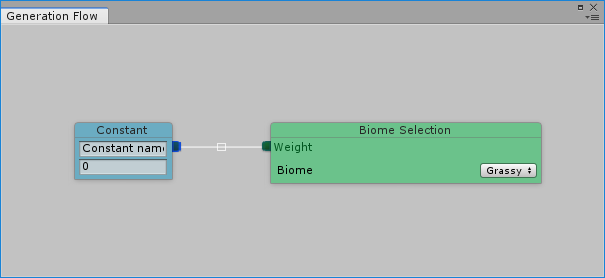

It can be a bit confusing to think about this at first without seeing it in action, so let's try it out:
* Right click in some empty space to create a new node. Select *Final > Biome Selection*.
* In the new *Biome Selection* node, change the Biome dropdown to "Rocky Mountains".

Now we have 2 final nodes. Let's start out with a very simple example of how to choose one Biome over the other:
* Remove the *Constant* node.
* Add two new nodes: *2D Noises > Fast Noise 2D* and *Filters > Invert*.
* Attach the output of the *Fast Noise 2D* node to both the Grassy Hills *Biome Selection* node AND the input handle of the *Invert* node.
* Finally, attach the output of the *Invert* node to the Weight handle of the Rocky Mountains *Biome Selection* node.

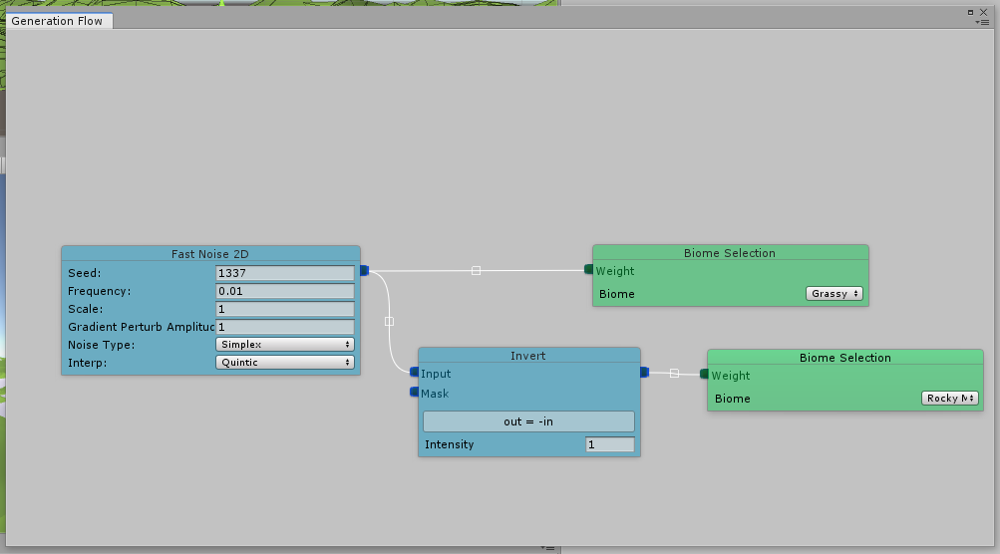

If we preview the terrain now, we should see alternating patches of our Grassy Hills Biome and our Rocky Mountains Biome (currently flat).

The patches look a bit small to be called Biomes, though. let's adjust some things to change how often we get a new Biome. You'll probably want to zoom out in your Scene view to get a sense of what's going on.
* Change the *frequency* of our noise (how often its values move between -1 and 1) to make the much larger. A value around 0.0006 worked well for me.
* Let's try changing what type of noise we're using. Feel free to play with each type.
* I liked Perlin Fractal noise for this purpose with an *Octaves* setting of 6 and a seed of 46789, but you can use whatever you like.

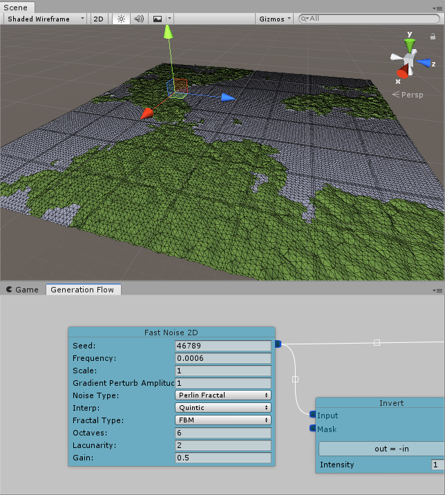

#### Editing the Mountains Biome

Now that we've got some biome selection up, let's hit the Edit Biome button for our Rocky Mountains. Once again we're starting with a flat Biome, but we can change that pretty quickly:
* Delete the *Constant* node hooked up to the *To Height* node.

As of this writing, the Biome Selector doesn't blend voxel values between Biomes, which can result in pretty hard edges with sudden elevation changes. A release is coming soon that adds Biome blending, but until then we're going to have to cheat a little to get our mountains to blend into our landscape.
* Create a *Fast Noise 2D* node that matches your Biome selector's noise node. If you used the above values, the settings were:
  * Seed: 46789
  * Frequency: 0.0006
  * Noise Type: Perlin Fractal
  * Octaves: 6
  * Everything else default.  
* Hook it up to a new *Invert* node, same as in our Biome Selector.

This will form the basis for our mountain ranges, but if we hook this up to a *To Height* node right now, the foot of our mountains will sit well below our hills, which is a bit odd.
* Connect the output of the *Invert* to a new *Clamp* node. This will keep our values between 0 and 1.
* Connect the output of the *Clamp* node to our *To Height* node.
* Set the scale of our *To Height* node to a large value; say, 400.

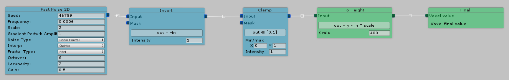

A good start, but they're neither very rocky nor very impressive. Let's address this by creating some finer noise that we'll multiply on top of the noise that is generating our peaks:
* Create another new *Fast Noise 2D* node with the following settings:
  * Seed: 879415
  * Frequency 0.01 (bigger number, finer noise)
  * Scale: 1
  * Noise Type: Perlin Fractal
  * Octaves: 6
* Hook that up to an *Filter > Abs* node to force its output to be positive.
* Create a constant node. This node will shift the output of our 0-1 noise up so that we're never multiplying our main mountain noise by less than its value.
  * Name: "Multiplier offset"
  * Value: 2 (makes the range 2-3
* Create a new *Blend* node in Add mode
  * Hook up the output of the *Constant* and *Abs* nodes to the inputs of the *Blend*.
  
When you're finished creating this little node group it should look something like the image below.
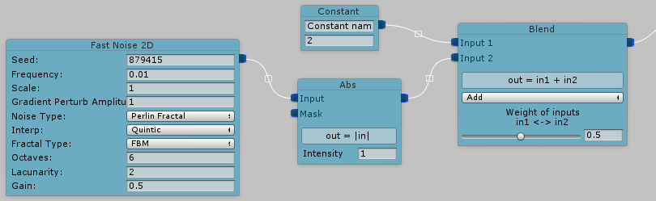

To combine this new noise with our mountain peak noise:
* Create a new *Blend* node in multiply mode.
* Hookup the output of our *Clamp* node (from our inverted mountain noise) to the *Blend* node's first input.
* Hookup the output of our new rocky noise cluster's *Blend* node to our new *Blend* node's second input.
* Finally, hook up the output of the new *Blend* node to our *To Height* node.

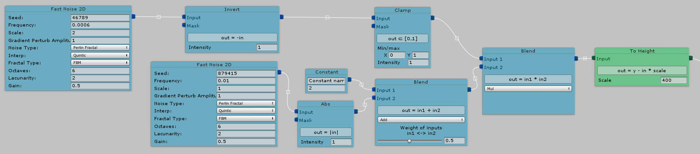

That should have our mountains looking at least a little more interesting and rocky. If you're confused about how the shapes you're seeing are being generated, try to trace the math along through the graph view.

While our mountains look OK now, we're really not doing anything with our terrain that couldn't be achieved with a 2D terrain system. Let's add another dimension to our work:
* Create a new node *3D Noises > LibNoise Perlin 3D* with the following settings:
  * Frequency: 0.0028
  * Scale: 0.75
  * Seed: 736498
  * Quality: Standard

You'll notice this node is green, rather than blue. 2D nodes are blue while 3D nodes are Green. The *To Height* node is also green because it converts from a 2D value to a 3D one.

If we blend this node directly into our 2D outputs (say, by adding a *Blend* node after our *To Height* node), we'll get a giant endless blob of 3D noise like the image below. Not really what we're going for...

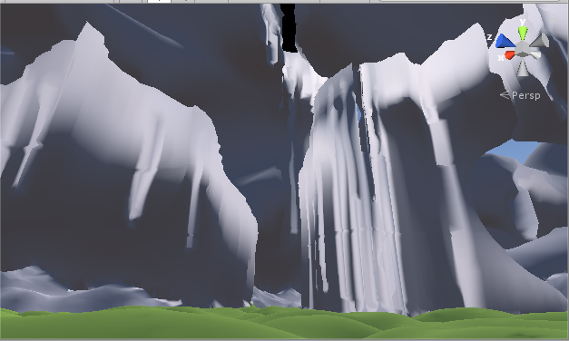

Let's temper this a bit with a *Curve* node:
* Create a new node *Filter > Curve*
* Attach the output of the *LibNoise Perlin 3D* node to the input of the *Curve* node

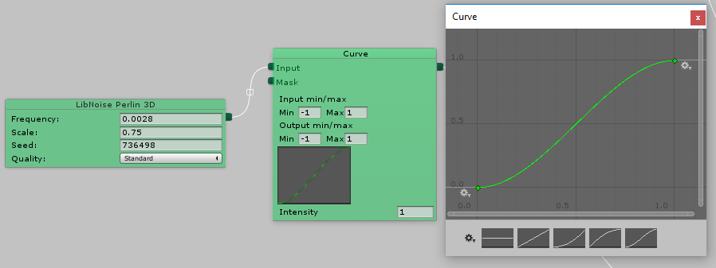

The *Curve* node is an extremely powerful and versatile tool. It basically remaps input values to new outputs based on the equation of an editable curve. It an extremely helpful way to tune and modify the output values of nodes and can create some very helpful and interesting effects.
* Click the thumbnail of the curve to edit it.
* Select the right-most preset, shaped like an 's'.

This will have the effect of increasing the "contrast" of our values; the noise created by our node will output more values close to 1 and -1 and fewer values in the middle ranges near 0.

Let's use a curve in a different way. If we attach the output of our original mountain noise to a curve, we can use it as a kind of mask for our 3D noise. Using a curve will allow us to massage the values of the mask so that we get a bit more blend in our 3D noise and see it only around the highest points of our mountains.
* Create a second *Curve* node and attach the output of our very first *Fast Noise 2D* node to its input
* Select the curve node's thumbnail and select the convex curve (second from the right) and set its output values to Min: -1, Max: 0.
* Create a new node: *Transformer > To Height* and hook it up to the output of this new curve.
* Set the scale to match our other *To Height* node: 400

These will serve as our height mask. Multiplying our 3D noise with this mask will limit its effect to where values of both the original mountain noise and the 3D noise are close to one another. The curve we applied changes the mask slightly to allow more influence.
* Create a *Blend* node in multiply mode.
* Connect the output of our 3D noise 'S' curve to Input 1 of the new *Blend* node.
* Connect the output of our new *To Height* node.
* Set the scale of our new *To Height* node to match our other *To Height* node; in this case 400.

Finally let's combine the 2D and 3D portions of our graph together. The math here is a little weird; we'll be using a *Blend* node in Subtract mode which will have the effect of adding to our terrain. Let's hook it up, then we can break down the math:
* Create one last *Blend* node in subtract mode.
* Connect the output of our 2D branch's *To Height* node to Input 1
* Connect the output of our 3D branch's last *Blend: Mul* node to Input 2
* Finally, connect the output of the new *Blend: Sub* node to our *Final* node.

The finished result should look like the image below.
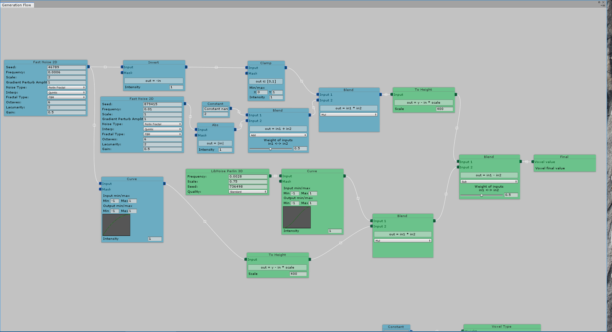

In some places the differences should be subtle, but in others you should see results like this:
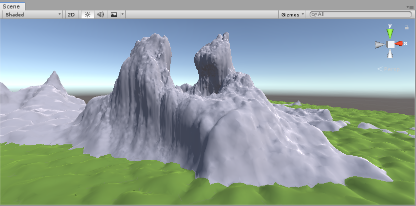

Pretty extreme mountains! Maybe not to your taste, but hopefully you have learned enough at this point to play with modifying them to suit your own desires. Believe it or not, this is a fairly simple Biome graph. Don't be afraid to build off of this foundation and experiment with layering in more complexity!

## Grass, Details, and Trees
Now that we have a basic terrain to work with, let's make it look a little less barren by adding grass, trees, and other detail objects.

### Adding grass

Ultimate Terrains comes with a simple, but powerful grass generator. Grass is generated based on the Voxel Type, which allows to add different kind of grass to different parts of your terrain and to choose where to put grass and where not to put it.

If we try to add grass without setting up a grass material uTerrains will complain, so let's do that first:
* In the Project view under our Materials folder, create a new folder called Grass Materials
* In the Grass Materials folder, create a new Material called Basic Grass
* Change the shader for the new material to _uTerrains/WavingGrass_
* For the Base Color texture, let's just select one of the included example textures: Grass02

Now we need to tell uTerrains to use this material for grass.
* In the uTerrains Inspector Go to the Voxel Types tab
* Under the __Grass Global Settings:__ heading, drag our new Basic Grass material into the _Grass material 0_ slot.

Now we need to add grass to one of our Voxel Types:
* Scroll down to our Grass Voxel Type and check the 'Enable grass' checkbox (you may have to unfold the voxel type by clicking on the little arrow at its left).

Some new parameters appear that will allow us to configure our grass.  

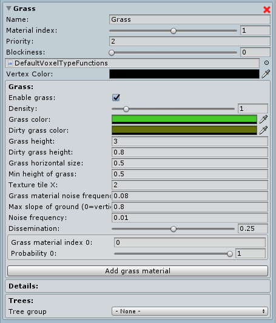

For now, let's just leave everything as is and see how it looks:
* Press Play to see your terrain with grass on it.

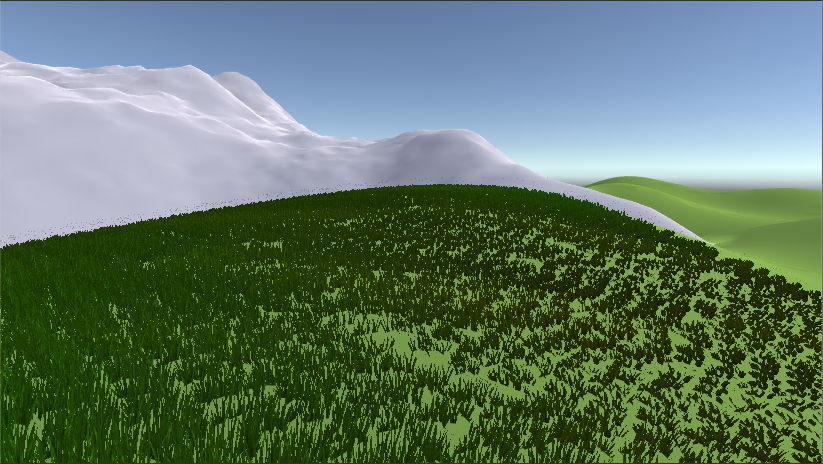

Not bad, but a bit uniform. Lets have our grass randomly choose between two different grass materials. First we'll need to create another material for uTerrains to use.
* In the project view, duplicate your Basic Grass material and rename it 'Basic Grass 2'
* Change out the Grass02 texture for another included texture: Grass01

Now lets tell uTerrains to choose between our two materials.
* Under **Grass Global Settings** in the Voxel Types tab, click the _Add Grass Material_ button.
* Drag our new Basic Grass 2 material into the slot next to our new grass material index.

If you scroll down to the bottom of our Grass Voxel Type's Grass settings, you'll see another _Add grass material_ button. This is how we'll tell this particular Voxel Type to use different materials for its grass:
* Click this _Add grass Material_ button, too. A new Grass material entry will appear.
* Set _Grass material index 1_ to 1. This is the index of our second grass material.
* Set the _Probability_ field of _Grass material index 0_ to 0.5.
* Set the _Probability_ field of _Grass material index 1_ to 1.0.

When you are done, your settings should look something like the following image.
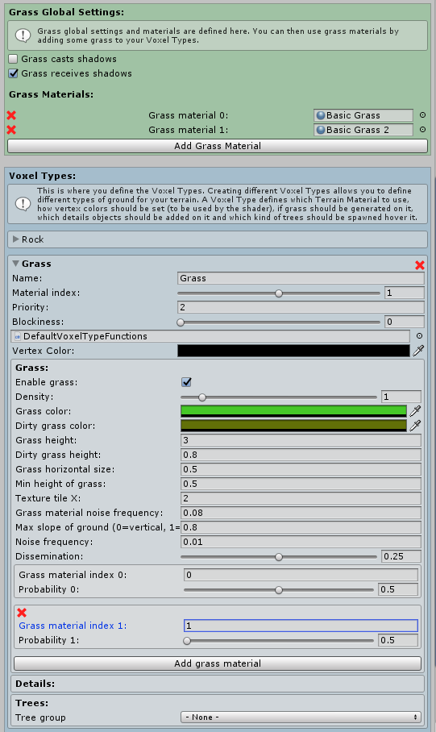

* Enter Play mode to see the result. As you fly around, you should see the grass change from one material to another.

Feel free to continue tuning your grass. If you want to learn more about what each parameter does, check out the [Grass Parameters Documentation](voxel-types-grass-parameters.md)

### Adding Details

You have some grass, but you'd like to add some other plants or some stones or mushrooms or whatever details to your terrain. This is what details object are made for. In Ultimate Terrains, details objects are exclusively GPU instanced to avoid GameObjects overhead.

Go to the 'Scenery' tab, and 'Details' sub-tab.

Click on 'Add detail group'. A details group may be a set of stones, or a set of different plants for example. As you see, you can have one or more details objects per details group. A details object is defined by a mesh and a material. You cannot put gameobjects prefabs directly.

Give a name to your new details group (for example, "Stones"), and change its density to 2.

Then, go to Assets/uTerrains/Scenes/Misc/Rock_Set/Rock. There are an imported rock model, its texture and its material. Unfold the model 'Rock' and drag & drop its mesh into the 'Mesh 0' field of the detail object. Same thing for the material: drag & drop the 'RockMaterial' to the 'Material 0' field of the detail object.

Now you have a simple details group defined, containing a single detail object.

If you press Play, you will see that nothing changed! This is because you have to enable the details group on a voxel type to see it. Go back to the 'Voxel types' tab, and check the checkbox called 'Enable details 'Stones'.

Now, press Play. Thousands of little stones are spread over the ground! These stone don't look so good, I agree, but this is just an example. It's up to you now to use this for plants, wood sticks, mushrooms or whatever.

### Adding Trees

All right, your terrain looks better and better, but it is missing one important thing: trees.

Trees are spawned independently from terrain generation. The job is done in parallel of terrain generation. This is very fast and does not slow down the terrain.

Trees are spawned as GameObjects (not GPU instanced) so they can have colliders and so on. However, it is up to you to ensure that your trees has some LOD system. Ultimate Terrains won't generate billboards for you as the standard Unity terrain does. This is why I recommend to use SpeedTrees: they come with LODs and colliders out of the box.

Got to the 'Scenery' tab and 'Trees' sub-tab.

The first parameter 'Max LOD with trees' controls the distance (in term of terrain LOD) at which trees will be spawned. Set this value to 4.

The second parameter, 'Max trees spawned per frame', controls how many trees (at maximum) should be spawned per frame. 10 is generally a good value as it prevents lags.

Tree density is very important as it controls the average distance between two trees. This is more the inverse of the density actually, because the bigger it is, the less trees will be spawned. Set this value to 20.

Density noise controls the frequency at which the tree density varies. Indeed, trees are spread thanks to this noise to make it more realistic.

Finally, 'Trees height' represents the average height of a tree. This setting is extremely important as Ultimate Terrains will make sure there is enough vertical space before adding a tree somewhere. Ultimate Terrains also uses this internally as a step to find where is the surface, so the lower it is, the longer it will be to spawn trees. Avoid to set a value lower than 10.

Below these settings, there is some space for Trees Groups.

Trees groups are similar to details groups, except that they contains a list of GameObjects (instead of mesh/material pairs). Click now on 'Add tree group', give it a name and drag & drop a tree object in the 'Tree 0' field. You can take a tree from SpeedTree that is available in the Unity's Environment package (menu Assets > Import package... > Environment).

Like for details, you have to enable the tree group on your Voxel Type otherwise it won't be used and no tree will be spawned.  

So go to the Voxel Types tab in the uTerrains Inspector, and choose the tree group you've just created in the 'Tree group' dropdown of your Voxel Type.

Press play and see the result. You might be surprised to see that trees are spawned before the terrain has finished to be generated. This is because trees system does its job independently from terrain generation.

## Summary and Next Steps

Hopefully this tutorial has left you with a pretty good high-level understanding of how to use Ultimate Terrains.

Perfecting a uTerrain for your game's specific needs will likely require spending a lot more time with the tools we've touched on here. The best way to get there is to dive in and start working. The more time you spend with the tools the better you will get to know them.

For specific topics, check out the rest of the documentation, and for help with questions not yet covered in the documentation, head over to the [official Ultimate Terrains Discord channel](https://discord.gg/tzrBuyY) and introduce yourself!