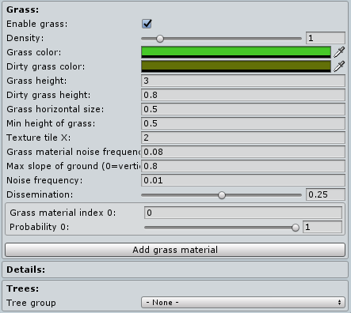

# Grass Parameters

Ultimate Terrains comes with a simple, but powerful grass generator. Grass is generated based on the Voxel Type, which allows to add different kind of grass to different parts of your terrain.

## Enabling Grass

To enable grass for a particular Voxel Type:
* Navigate to the uTerrains Inspector's Voxel Types tab
* Expand the desired Voxel Type
* Under the **Grass** heading check the box next to _Enable grass_.

## Grass Parameters

### Density:
Per-voxel probability of spawning grass.

### Grass color:
Color multiplier for the grass.

### Dirty grass color:
In transitional areas between where grass spawns and doesn't spawn, grass will blend toward this color.

### Grass height:
Overall maximum height of the grass.

### Dirty grass height:
Overall maximum height of transitional grass.

### Grass horizontal size:
Width of the grass geometry.

### Min height of grass:
**Needs explanation**

### Texture tile X:
How many times the base texture will tile across grass geometry.

### Grass material noise frequency:
How frequently the material will change between different material indices.

### Max slope of ground (0=vertical, 1=horizontal):
The maximum geometric slope that grass can spawn on.

### Noise frequency:
How frequently areas transition between spawning grass and not spawning grass. Smaller numbers will yield larger areas of grass.

### Dissemination:
**Needs explanation**

## Grass Materials
Each Voxel Type can use multiple material indices to randomize the look of its grass. The settings for each material are as follows.

### Grass material index:
Which material index to use as defined in the **Grass Global Settings** section of the Voxel Types tab.

### Probability:
When a material with a lower index is not picked, what is the probability of picking this one instead. (Dictates the minimum priority for the next index)

### Add Grass Material Button
Adds a new material index